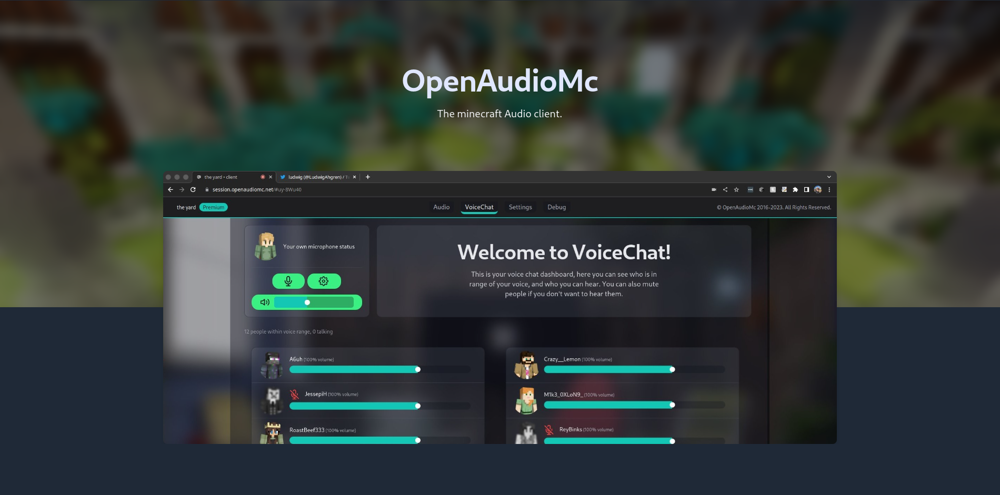

# OpenAudioMc

OpenAudioMc is a plugin for Minecraft that provides proximity voice chat and audio system without the need for mods. It works on servers running Bungeecord, Velocity, Spigot, and more.

## Features

- Proximity Voice Chat (with spatial and normal audio)
- Full built-in moderation support
- Music and sound effects without resource pack
- Native Worldguard integration to assign music to regions and query for key locations
- Speaker blocks you can place throughout your world to add audio in special places
- Built-in TrainCarts hook to adding on-board music for rides
- LiteBans support to syncronize mutes with voice chat
- Feature rich java API
- Easy to use web clients (players receive their own personal link, no downloads or accounts required)
- Automatic client translation in 9 languages
- Automatic CDN infrastructure to speed up file delivery without any configuration
- Active support and community
- User preferences and client settings

## Supported platforms
- [Spigot (1.12 and up, with primitive support for lower versions)](https://www.spigotmc.org/resources/openaudiomc-open-source-audio-client.30691/ "Spigot Plugin Page")
- [BungeeCord (recent builds)](https://www.spigotmc.org/resources/openaudiomc-open-source-audio-client.30691/ "Spigot Plugin Page")
- [Velocity](https://www.spigotmc.org/resources/openaudiomc-open-source-audio-client.30691/ "Spigot Plugin Page")

## Notes on testing
The Java plugin/implementation and vistas platforms come bundled with maven unit tests. All tests *must* pass before pull requests can definitively be reviewed.
Please note that the test for `vistas-server` use an embedded Redis server that will be installed on your system. This is known to use up to 20 gigs of storage in Windows and sometimes leaves trailing background processes, so please keep an eye on that if you only wish to build a jar once and don't care about keeping development software on your machine. Tests aren't required to build a functional target, so  you can disable them all together if you want to.

## Useful Links
* **Patreon** - <https://patreon.com/mindgamesnl>
* **Website** - <https://openaudiomc.net/>
* **Discord Community** - <https://discord.openaudiomc.net/>
* **Documentation** - <https://openaudiomc.net/docs>
* **Client** - <https://session.openaudiomc.net/>

# Codebase core terminology
- **Platform**: refers to the server environment where OpenAudioMc is running, like Bungeecord, Spigot, Velocity and Standalone
- **Service**: Most of the internal codebase was re-written and refactored during the 6.5.5 update, where we migrated to a custom service manager with support for annotation based dependency injection, service abstraction and to provide pointer safety during reloads.
  The service manager is registered in the main OpenAudioMc class and is accessible through all platforms. The entire ecosystem consists of two main registration types. Services are static code implementations that can be injected, requested and manipulated after loading (or being requested, in which case they’ll be loaded if they weren’t already)
- **Module**: Modules are jar files with extra content, features or scripts that modify default OpenAudioMc behaviour. Usually used to integrate with third party plugins.

# Project structure
- `plugin/` contains the plugin and framework source code
- `client/` contains the source code, build scripts and assets of the production web client
- `modules/jutils` contains legacy java libraries that are only used during migrations
- `modules/migrator` contains the migrator that converts legacy MapDB database stores to Sqlite through Storm
- `modules/parties` contains the module integrating with the official [Parties](https://www.spigotmc.org/resources/parties-an-advanced-parties-manager.3709/) plugin
- `modules/skywars` contains the module integrating with native Skywars game states ([Skywars Reloaded](https://github.com/lukasvdgaag/SkyWarsReloaded))
- `modules/rinoarc-legacy` contains the commissioned module from Rinoarc for legacy 1.8 support
- `modules/vistas-server` a standalone OpenAudioMc installation that links over redis, for enterprise deployments with multiple bungee or lilypad proxies
- `modules/vistas-client` a plugin runtime implementation for vistas, to hook into a redis based mesh network