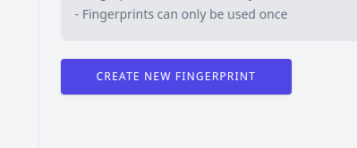
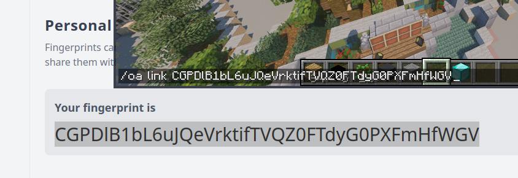

[//]: # (TITLE:Linking your account)
[//]: # (DESCRIPTION:Link your Minecraft server to your Craftmend account)
[//]: # (TAGS:accounts,linking,craftmend,setup,minecraft,plugin,link)

# Account Setup Guide
## IMPORTANT! accounts are only available for versions 6.5 and up, older versions still use the old panel on `/oa plus`
## Step #1 - Creating  your account
This couldn't be simpler, just navigate to [the registration page](https://account.craftmend.com/register), create your account and verify your email.

## Step #2 - Linking your server
Your account is empty by default since you don't have any servers yet. Head over to the [fingerprint page](https://account.craftmend.com/account/fingerprint) to create your first fingerprint. Fingerprints are one-time codes which can be used to verify your identity.

#### Click the big blue button to create your first fingerprint

 
 

#### You can then copy the fingerprint, and paste it into the link command like so

(you can alternatively follow the guide on the servers page)

## Step #3 - Verify your server
Your server should now appear on the [servers page](https://account.craftmend.com/account/openaudiomc/servers), and that's it! good job :)

# Important notes
 - You can only have one active fingerprint at a time, generating them in bulk is no use.
 - Only your top-level server (so that's bungeecord, if you have a proxy) needs to be linked.